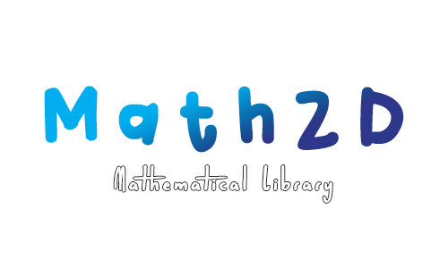

## What's Math2d

> A collection of useful Mathematical and Vector tools in 2D space

Math2D is a library written in Ruby designed to help programmers with 2D projects - specifically, I started developing this tool to use it in my projects with the [Ruby2D gem](https://github.com/ruby2d/ruby2d). It provides several mathematical and vector functions and tools in two-dimensional Euclidean space.

## How to use

Install it with `gem install math2d` for the latest version of the gem and simply include it with `require 'math2d'` at the top of your code. 

The `Math2D` namespace provides a `Vector2D` class, which, as the name suggests, deals with 2D vectors, and the `Utils2D` module, which includes some useful non-vector specific mathematical methods and constants.

## Documentation

Documentation can be found:

- At [Rubydoc](https://www.rubydoc.info/gems/math2d);
- In comments above each module, class and method following YARD's syntax;
- In the [doc](doc/) folder.

## Examples

Examples can be found in the [examples](examples/) folder. Currently, all examples use [Ruby2D](https://github.com/ruby2d/ruby2d).

## Development

After checking out the repo, 
* run `bundle install` to install dependencies;
* then, run `rake spec` to run the tests. 

## Credits

A special thanks to the creators of the [p5.js website](https://p5js.org/) and the [Unity's Scripting API website](https://docs.unity3d.com/ScriptReference/). Most ideas for the methods in this library came from these two places. Specially, most if not all methods descriptions come from p5.js.

Also, thanks to the folks at the [Ruby2D discord channel](https://discord.com/invite/QBWguEasV7) for supporting me and this little gem of mine. Thank you, guys :)
